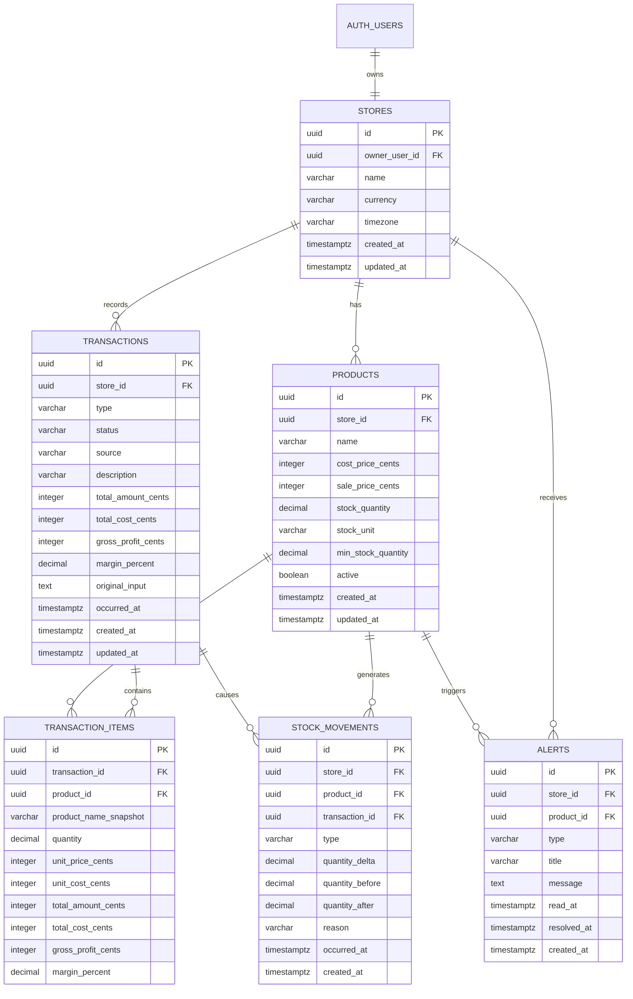

# Modelagem de Dados — ContAI

## Estratégia para a entrega de hoje

Prazo considerado: **19/08/2026 às 16h (America/Sao_Paulo)**.

Para o vídeo, o banco precisa sustentar somente o fluxo que demonstra o valor do produto:

1. Lojista entra no aplicativo.
2. Visualiza produtos e estoque.
3. Digita ou fala uma venda.
4. Confere uma prévia.
5. Confirma a venda.
6. O estoque é reduzido.
7. O dashboard mostra faturamento, custo, lucro e margem atualizados.

O modelo completo foi pensado para crescer, mas a implementação de hoje deve priorizar as tabelas marcadas como **MVP obrigatório**.

---

## Diagrama de relacionamento



---

## 1. `stores` — MVP obrigatório

Representa o negócio do usuário. No MVP existe uma loja para cada conta.

| Coluna | Tipo PostgreSQL | Obrigatório | Regra |
|---|---|---:|---|
| `id` | `uuid` | sim | PK, `gen_random_uuid()` |
| `owner_user_id` | `uuid` | sim | FK para `auth.users(id)`, único |
| `name` | `varchar(120)` | sim | Nome exibido no app |
| `currency` | `char(3)` | sim | Default `BRL` |
| `timezone` | `varchar(50)` | sim | Default `America/Sao_Paulo` |
| `created_at` | `timestamptz` | sim | Default `now()` |
| `updated_at` | `timestamptz` | sim | Default `now()` |

Restrições:

- `UNIQUE(owner_user_id)` na primeira versão.
- O usuário nunca envia `owner_user_id`; ele é obtido do token.

---

## 2. `products` — MVP obrigatório

Mantém o catálogo e a posição atual do estoque.

| Coluna | Tipo PostgreSQL | Obrigatório | Regra |
|---|---|---:|---|
| `id` | `uuid` | sim | PK |
| `store_id` | `uuid` | sim | FK para `stores(id)` |
| `name` | `varchar(200)` | sim | Nome comercial |
| `sku` | `varchar(80)` | não | Código opcional |
| `description` | `text` | não | Descrição opcional |
| `cost_price_cents` | `integer` | sim | Custo médio unitário, default `0` |
| `sale_price_cents` | `integer` | sim | Preço padrão de venda |
| `stock_quantity` | `numeric(12,3)` | sim | Estoque atual, default `0` |
| `stock_unit` | `varchar(20)` | sim | Unidade do produto, default `UNIT` |
| `custom_stock_unit` | `varchar(30)` | não | Usado somente com `OTHER` |
| `min_stock_quantity` | `numeric(12,3)` | sim | Ponto de alerta, default `0` |
| `active` | `boolean` | sim | Default `true` |
| `created_at` | `timestamptz` | sim | Default `now()` |
| `updated_at` | `timestamptz` | sim | Default `now()` |

Restrições:

- `cost_price_cents >= 0`.
- `sale_price_cents >= 0`.
- `min_stock_quantity >= 0`.
- `stock_unit IN ('UNIT','KG','G','L','ML','M','BOX','PACKAGE','OTHER')`.
- Nome único entre produtos ativos da mesma loja, comparado com `lower(trim(name))`.
- `stock_quantity` pode ficar negativo para não bloquear a demonstração ou uma venda real.

Índices:

- `(store_id, active)`.
- `(store_id, lower(name))`.
- `(store_id, stock_quantity)`.

Decisão importante: o estoque atual fica em `products` para leitura rápida. O histórico completo fica em `stock_movements`.

---

## 3. `transactions` — MVP obrigatório

Cabeçalho financeiro de cada venda, compra, despesa ou receita.

| Coluna | Tipo PostgreSQL | Obrigatório | Regra |
|---|---|---:|---|
| `id` | `uuid` | sim | PK |
| `store_id` | `uuid` | sim | FK para `stores(id)` |
| `type` | `varchar(20)` | sim | `SALE`, `PURCHASE`, `EXPENSE`, `INCOME` |
| `status` | `varchar(20)` | sim | `CONFIRMED` ou `CANCELLED` |
| `source` | `varchar(20)` | sim | `TEXT`, `VOICE` ou `MANUAL` |
| `description` | `varchar(500)` | sim | Texto legível no histórico |
| `category` | `varchar(80)` | não | Categoria de despesa/receita |
| `total_amount_cents` | `integer` | sim | Faturamento, compra, despesa ou receita |
| `total_cost_cents` | `integer` | sim | Custo congelado no momento da venda |
| `gross_profit_cents` | `integer` | sim | Valor total menos custo nas vendas |
| `margin_percent` | `numeric(7,2)` | não | `null` quando o total for zero |
| `original_input` | `text` | não | Texto digitado ou transcrição |
| `occurred_at` | `timestamptz` | sim | Momento informado pelo usuário |
| `confirmed_at` | `timestamptz` | sim | Momento da confirmação |
| `cancelled_at` | `timestamptz` | não | Momento do cancelamento |
| `cancellation_reason` | `varchar(300)` | não | Motivo do cancelamento |
| `idempotency_key` | `uuid` | sim | Impede confirmação duplicada |
| `created_at` | `timestamptz` | sim | Default `now()` |
| `updated_at` | `timestamptz` | sim | Default `now()` |

Restrições:

- `total_amount_cents >= 0` e `total_cost_cents >= 0`.
- `UNIQUE(store_id, idempotency_key)`.
- `SALE` e `PURCHASE` devem possuir pelo menos um item.
- `EXPENSE` e `INCOME` não possuem itens no MVP.

Índices:

- `(store_id, occurred_at DESC)`.
- `(store_id, type, occurred_at DESC)`.
- `(store_id, status)`.

Por que salvar totais: evita recalcular todo o histórico no dashboard e preserva exatamente o valor confirmado.

---

## 4. `transaction_items` — MVP obrigatório

Produtos associados a vendas ou compras.

| Coluna | Tipo PostgreSQL | Obrigatório | Regra |
|---|---|---:|---|
| `id` | `uuid` | sim | PK |
| `transaction_id` | `uuid` | sim | FK para `transactions(id)` |
| `product_id` | `uuid` | sim | FK para `products(id)`, `ON DELETE RESTRICT` |
| `product_name_snapshot` | `varchar(200)` | sim | Nome congelado para o histórico |
| `stock_unit_snapshot` | `varchar(20)` | sim | Unidade congelada |
| `quantity` | `numeric(12,3)` | sim | Deve ser maior que zero |
| `unit_price_cents` | `integer` | sim | Preço praticado por unidade |
| `unit_cost_cents` | `integer` | sim | Custo na hora da operação |
| `total_amount_cents` | `integer` | sim | `quantity × unit_price` |
| `total_cost_cents` | `integer` | sim | `quantity × unit_cost` |
| `gross_profit_cents` | `integer` | sim | Total menos custo |
| `margin_percent` | `numeric(7,2)` | não | Margem do item |
| `created_at` | `timestamptz` | sim | Default `now()` |

Restrições:

- `quantity > 0`.
- Valores unitários e totais não negativos, exceto `gross_profit_cents`, que pode ser negativo.
- Índice em `(transaction_id)` e `(product_id)`.

O snapshot é necessário porque o lojista pode renomear ou alterar o custo do produto depois da venda.

---

## 5. `stock_movements` — recomendado para o vídeo

É o extrato auditável do estoque. Mesmo que não haja uma tela completa hoje, registrar os movimentos evita inconsistências e facilita demonstrar a baixa da venda.

| Coluna | Tipo PostgreSQL | Obrigatório | Regra |
|---|---|---:|---|
| `id` | `uuid` | sim | PK |
| `store_id` | `uuid` | sim | FK para `stores(id)` |
| `product_id` | `uuid` | sim | FK para `products(id)` |
| `transaction_id` | `uuid` | não | FK para `transactions(id)` |
| `type` | `varchar(20)` | sim | `INITIAL`, `SALE`, `PURCHASE`, `ADJUSTMENT`, `REVERSAL` |
| `quantity_delta` | `numeric(12,3)` | sim | Venda negativa; compra positiva |
| `quantity_before` | `numeric(12,3)` | sim | Estoque antes |
| `quantity_after` | `numeric(12,3)` | sim | Estoque depois |
| `reason` | `varchar(300)` | não | Obrigatório em ajuste manual |
| `occurred_at` | `timestamptz` | sim | Data efetiva |
| `created_at` | `timestamptz` | sim | Default `now()` |

Restrições:

- `quantity_delta <> 0`.
- `quantity_after = quantity_before + quantity_delta`.
- Índices em `(product_id, occurred_at DESC)` e `(transaction_id)`.

---

## 6. `alerts` — pode entrar depois do fluxo principal

| Coluna | Tipo PostgreSQL | Obrigatório | Regra |
|---|---|---:|---|
| `id` | `uuid` | sim | PK |
| `store_id` | `uuid` | sim | FK para `stores(id)` |
| `product_id` | `uuid` | não | FK para `products(id)` |
| `type` | `varchar(30)` | sim | `LOW_STOCK`, `NEGATIVE_STOCK`, `NEGATIVE_MARGIN` |
| `title` | `varchar(200)` | sim | Título para o app |
| `message` | `text` | sim | Mensagem para o app |
| `read_at` | `timestamptz` | não | `null` significa não lido |
| `resolved_at` | `timestamptz` | não | `null` significa ativo |
| `created_at` | `timestamptz` | sim | Default `now()` |

Regra: apenas um alerta ativo de cada tipo por produto. Ao repor estoque acima do mínimo, resolver automaticamente o alerta de estoque baixo.

---

## Dados que não precisam de tabela no MVP

### Preview

Para cumprir o vídeo rapidamente, o preview pode ser calculado pelo backend e mantido no estado do Flutter por poucos minutos. Na confirmação, o Flutter envia apenas os campos editáveis e o backend busca o produto e recalcula tudo.

Depois da entrega, o preview pode ser armazenado em cache ou na tabela `transaction_previews` com expiração.

### Dashboard

O dashboard é calculado por consultas sobre `transactions`, `transaction_items` e `products`. Não precisa de tabela própria no MVP.

### Monetização

Planos e assinaturas não precisam de tabela para o vídeo. Quando a cobrança for implementada, adicionar `plans`, `subscriptions` e `usage_records`.

---

## Operação atômica de confirmação da venda

A confirmação precisa executar dentro de uma transação de banco:

```text
BEGIN
  1. Verificar idempotency_key.
  2. Buscar e bloquear os produtos da venda.
  3. Recalcular preço, custo, totais, lucro e margem.
  4. Criar transactions.
  5. Criar transaction_items.
  6. Atualizar products.stock_quantity.
  7. Criar stock_movements.
  8. Criar alerta se o estoque atingir o mínimo.
COMMIT
```

Se qualquer passo falhar, executar `ROLLBACK`. Nunca pode existir venda confirmada sem a respectiva baixa de estoque.

---

## Exemplo completo

Produto antes da venda:

```json
{
  "name": "Camiseta básica",
  "cost_price_cents": 3000,
  "sale_price_cents": 5000,
  "stock_quantity": "10.000",
  "stock_unit": "UNIT",
  "min_stock_quantity": "2.000"
}
```

O usuário diz: “vendi duas camisetas por cinquenta cada”.

Resultado confirmado:

```text
Faturamento: 2 × R$ 50,00 = R$ 100,00
Custo:       2 × R$ 30,00 = R$ 60,00
Lucro bruto: R$ 100,00 - R$ 60,00 = R$ 40,00
Margem:      R$ 40,00 ÷ R$ 100,00 = 40%
Estoque:     10 - 2 = 8 unidades
```

Registros criados:

- Uma linha em `transactions` com totais de `10000`, `6000` e `4000` centavos.
- Uma linha em `transaction_items` com quantidade `2.000`.
- Uma linha em `stock_movements` com delta `-2.000`, antes `10.000` e depois `8.000`.
- Atualização de `products.stock_quantity` para `8.000`.

---

## RLS e isolamento dos lojistas

O usuário autenticado só pode acessar a loja em que `stores.owner_user_id = auth.uid()`.

Todas as políticas das tabelas filhas devem validar a propriedade por meio de `store_id`. Não basta confiar no identificador enviado pelo aplicativo.

Para a entrega de hoje, o seed pode criar uma conta e uma loja de demonstração, mas a proteção entre usuários deve continuar prevista na migration.

---

## Corte objetivo para o vídeo das 16h

### Implementar

- `stores`.
- `products`.
- `transactions`.
- `transaction_items`.
- `stock_movements`.
- Seed com três produtos.
- Cadastro/listagem de produtos.
- Preview de uma venda com um produto.
- Confirmação e baixa do estoque.
- Resumo com faturamento, custo, lucro e margem.
- Entrada por texto; áudio pode usar o mesmo endpoint após transcrição.

### Se o tempo apertar

- Usar uma conta de demonstração fixa.
- Demonstrar venda com um item por vez, embora o banco já aceite vários.
- Adiar tela de alertas, cancelamento, compras, despesas e receitas.
- Manter cadastro inicial via seed.
- Priorizar áudio apenas se texto, confirmação e dashboard já estiverem funcionando.

### Não cortar

- Valores em centavos.
- Custo congelado no item da venda.
- Recalcular no backend.
- Atualizar venda e estoque na mesma transação.
- Uma demonstração completa sem mocks entre tela e banco.

